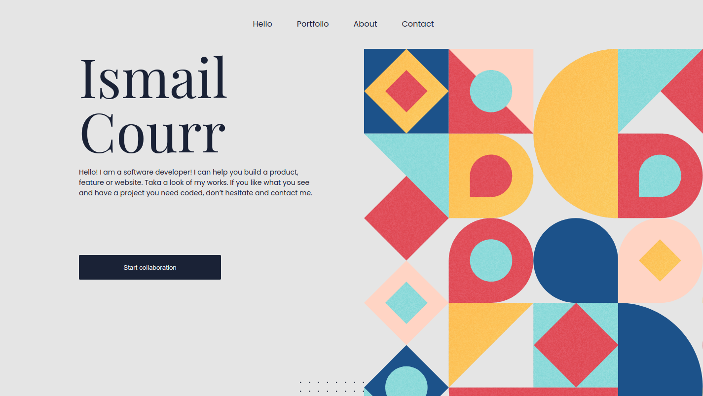

# Portfolio-Microverse

> This is a clone of the portfolio repo, created for the purpose of Debugging JavaScript code. the code has hidden bugs inside it and my partner will try to find them. This is a repo for educational purposes, the javascript file has bugs You can try and find them to sharpen your skills at debugging

## Built With

- HTML
- CSS
- FlexBox
- Grid
- JavaScript
- Github Pages

## Live Demo

[Live Demo Link](https://ismailco.github.io/Portfolio-Microverse/)

## Getting Started

To get a local copy up and running follow these simple example steps.

1- copy the repo URL
2- $ git clone (repo URL)

## Author

- GitHub: [@ismailco](https://github.com/Ismailco)
- Twitter: [@ismailcourr](https://www.twitter.com/ismailcourr)
- LinkedIn: [ismailcourr](https://www.linkedin.com/in/ismailcourr/)
- My Website: [ismailcourr.ml](https://www.ismailcourr.ml)

## 🤝 Contributing

This is a repo for educational purposes, the javascript file has bugs You can try and find them to sharpen your skills at debugging

## Show your support

Give a ⭐️ if you like this project!
